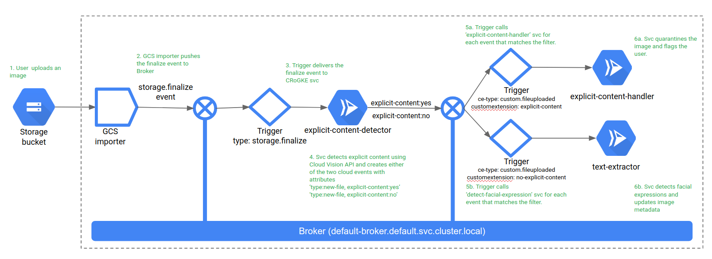

# Image processing using [Knative Eventing](https://github.com/knative/eventing/), [Cloud Run on GKE](https://cloud.google.com/run/) and [Google Cloud Vision API](https://cloud.google.com/vision/docs/)

## Component diagram


- User uploads an image to a GCS bucket
- <u>cmd/explicit-content-detector</u> is triggered when a new file get uploaded. It uses Cloud Vision APIs to detect if the image has [explicit content (adult, spoof, medical, violence, racy)](https://cloud.google.com/vision/docs/reference/rpc/google.cloud.vision.v1#google.cloud.vision.v1.SafeSearchAnnotation)
It then creates a new event (pkg/eventsschema/fileuploaded) with a customExtension:(explicit-content or no-explicit-content).
- <u>cmd/explicit-content-handler</u> gets triggered on this new event if customExtension:explicit-content. It will quarantine the image (move it to another bucket)
- <u>cmd/no-explicit-content</u> gets triggered on this new event if customExtension:no-explicit-content. It will extract text from the image, if present, using Cloud Vision API and create a new file in the original GCS bucket with the extracted text.

## Pre-reqs
### Google Cloud Setup
1. If you haven’t already done so, [install the Google Cloud SDK](https://cloud.google.com/sdk/docs/) and authenticate with gcloud auth login.
2. Create a new GCP project with a billing account (we do not recommend using an existing project. Creating a new project maintains separation from existing deployments).
3. If you don’t already have it, install kubectl with the command 
```
gcloud components install kubectl.
```

### Create a GKE cluster with Cloud Run addon
Follow the [Setup Guide](https://cloud.google.com/run/docs/gke/setup) for Cloud Run on GKE to create a cluster. Note: Please ensure the CloudRun addon is enabled during cluster creation.
```
gcloud beta container clusters create CLUSTER_NAME \
--addons=HorizontalPodAutoscaling,HttpLoadBalancing,Istio,CloudRun \
--machine-type=n1-standard-4 \
--cluster-version=latest --zone=ZONE \
--enable-stackdriver-kubernetes \
--scopes=cloud-platform,logging-write,monitoring-write,pubsub

gcloud services enable container.googleapis.com containerregistry.googleapis.com cloudbuild.googleapis.com

```
Replace CLUSTER_NAME with the name you used for your cluster, and if necessary replace us-central1-a with the supported cluster location of your choice.
> **Important**: Running a GKE configuration like the one described in this page can be costly. GKE is billed differently than Cloud Run, so you will be billed for each node in your cluster, even if you have no services deployed to them. To avoid charges, you should delete your cluster or scale the number of the nodes in the cluster to zero if you are not using it.

### Install Eventing
1. Install the core eventing components
```
kubectl apply --selector knative.dev/crd-install=true -f https://github.com/knative/eventing/releases/download/v0.10.1/release.yaml

kubectl apply -f https://github.com/knative/eventing/releases/download/v0.10.1/release.yaml
```

2. Install the GCP eventing components.

```
kubectl apply --selector events.cloud.google.com/crd-install=true -f  https://github.com/google/knative-gcp/releases/download/v0.10.1/cloud-run-events.yaml

kubectl apply -f https://github.com/google/knative-gcp/releases/download/v0.10.1/cloud-run-events.yaml
```

## Build and deploy application

1. Create a new namespace on the cluster so that clean-up is easy. Label it to enable eventing.
```
kubectl create ns image-processing

kubectl label ns image-processing knative-eventing-injection=enabled

# set the namespace as the default namespace for kubectl command
kubectl config set-context $(kubectl config current-context) --namespace=image-processing
```
2. Make sure the borker is Ready.
```
kubectl get broker
```

3. Create necessary storage buckets and configure them
    1. Create source bucket or choose an existing bucket. Bucket name must be unique
    ```
    export BUCKET=source-bucket # This is a global namespace, so replace my-bucket with something else.

    gsutil mb gs://$BUCKET
    ```
    2. Create a GCP Service Account and give it the Storage Admin role, so it can create object notifications for buckets in your project. Replace my-project-id with your actual project id. Since GCS importer uses Cloud Pub/Sub as the underlying transport mechanism for delivering those events to your cluster, you also need to grant pubsub.editor so that we can create topics/pullsubscriptions.
    ```
    export PROJECT_ID=my-project-id

    gcloud iam service-accounts create cloudrunevents-pullsub

    gcloud projects add-iam-policy-binding $PROJECT_ID --member=serviceAccount:cloudrunevents-pullsub@$PROJECT_ID.iam.gserviceaccount.com --role roles/storage.admin
    gcloud projects add-iam-policy-binding $PROJECT_ID \
    --member=serviceAccount:cloudrunevents-pullsub@$PROJECT_ID.iam.gserviceaccount.com \
    --role roles/pubsub.editor
    ```

    3. Download a new JSON private key for that Service Account. **Do not check this key into source control**
    ```
    gcloud iam service-accounts keys create imageprocessingkey.json --iam-account=cloudrunevents-pullsub@$PROJECT_ID.iam.gserviceaccount.com
    ```
    4. Grant GCS the rights to publish notifications to the pubsub (which is used as the transport layer). Replace imageprocessingkey.json if you created a different file for the credentials in above step.
    ```
    export GCS_SERVICE_ACCOUNT=`curl -s -X GET -H "Authorization: Bearer \`GOOGLE_APPLICATION_CREDENTIALS=imageprocessingkey.json gcloud auth application-default print-access-token\`" "https://www.googleapis.com/storage/v1/projects/$PROJECT_ID/serviceAccount" | grep email_address | cut -d '"' -f 4`
    ```
    5. Then validate that the GCS_SERVICE_ACCOUNT was fetched properly.
    ```
    echo $GCS_SERVICE_ACCOUNT
    ```
    You should see something like: service-XXXXX@gs-project-accounts.iam.gserviceaccount.com 
    6. Grant the service account the rights to publish to the pubsub.
    ```
    gcloud projects add-iam-policy-binding $PROJECT_ID --member=serviceAccount:$GCS_SERVICE_ACCOUNT --role roles/pubsub.publisher
    ```

4. Create K8s secret with the downloaded secret. The names google-cloud-key and key.json correspond to default values used by the GCS importer.
```
kubectl create secret generic google-cloud-key --from-file=key.json=imageprocessingkey.json
```

5. Enable cloud vision apis
``` 
gcloud services enable vision.googleapis.com 
```

6. Build and deploy application
    1. We will use [KO](https://github.com/google/ko) to build and deploy this application. Please [download and install KO](https://github.com/google/ko)

    2. Update config/image-processing-sample.yaml with correct values
        1. Replace _sourcebucket_ with the source cloud storage bucket id where images will be uploaded.
        2. Replace _quarantinebucket_ where images that have explicit-content will be moved to from _sourcebucket_
        _Please create a new quarantinebucket or use an existing one. Do not use sourcebucket to avoid application going in an infinite loop_
    3.  Review config/image-processing-sample.yaml. It has all the necessary components such as importers and triggers configured.
    ```
    ko apply -f config/image-processing-sample.yaml
    ```
## Test
We will use the files present in tesdata. There are spoofed and original version of images. Vision APIs will detect spoofed image.
Open three bash shell windows and start capturing pod logs using any tool. In this example we will use [stern](https://github.com/wercker/stern)
```
stern -l serving.knative.dev/configuration=explicit-content-detector -c user-container

stern -l serving.knative.dev/configuration=explicit-content-handler -c user-container

stern -l serving.knative.dev/configuration=text-extractor -c user-container
```


### Test explicit content flow
1. Upload the testdata/silky-spoofed.jpg to the sourcebucket
    ```
    gsutil cp testdata/silky-spoofed.jpg gs://<sourcebucketid>
    ```
2. Go to [Cloud Console UI](https://console.cloud.google.com) and browse the source as well as quarantine bucket. If the setup was correct then you should see silky-spoofed.jpg appear in quarantine bucket and gets deleted from source bucket.

3. See pod logs for some more details.

### Test non-explicit or safe content flow
1. Upload the testdata/silky-spoofed.jpg to the sourcebucket
    ```
    gsutil cp testdata/silky-not-spoofed.jpg gs://$BUCKET
    ```
2. Go to [Cloud Console UI](https://console.cloud.google.com) and browse the source as well as quarantine bucket. If the setup was correct then you should see silky-not-spoofed.jpg in the source bucket along with a new file silky-not-spoofed.jpg.txt. Open the image as well as the text file and see if the text matches.

3. See pod logs for some more details.

## Clean-up
1. Delete the kubernetes namespace or delete the GKE cluster
```
kubectl delete ns image-processing

#OR

gcloud container clusters delete <gek-cluster-name>
```
2. Delete the storage buckets if you created them
```
gsutil rb gs://<bucketId>
```
3. Delete all the service accounts that were creted
```
gcloud iam service-accounts delete cloudrunevents-pullsub
```
4. Delete the downloaded json key

## Troubleshooting
to do

